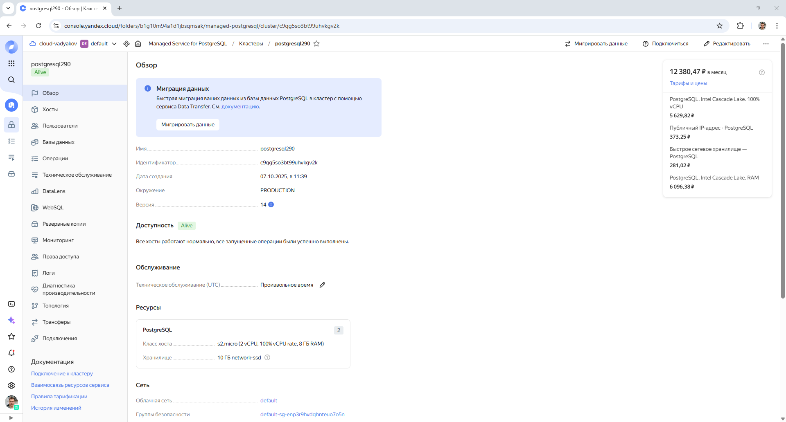
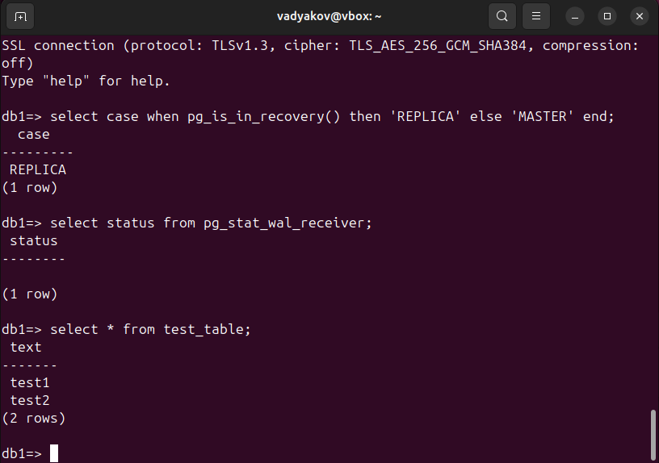

# Домашнее задание к занятию «Базы данных в облаке» - Дьяков Владимир

### Задание

#### Создание кластера
1. Перейдите на главную страницу сервиса Managed Service for PostgreSQL.
2. Создайте кластер PostgreSQL со следующими параметрами:
- класс хоста: s2.micro, диск network-ssd любого размера;
- хосты: нужно создать два хоста в двух разных зонах доступности и указать необходимость публичного доступа, то есть публичного IP адреса, для них;
- установите учётную запись для пользователя и базы.

Остальные параметры оставьте по умолчанию либо измените по своему усмотрению.

* Нажмите кнопку «Создать кластер» и дождитесь окончания процесса создания, статус кластера = RUNNING. Кластер создаётся от 5 до 10 минут.

#### Подключение к мастеру и реплике 

* Используйте инструкцию по подключению к кластеру, доступную на вкладке «Обзор»: cкачайте SSL-сертификат и подключитесь к кластеру с помощью утилиты psql, указав hostname всех узлов и атрибут ```target_session_attrs=read-write```.

* Проверьте, что подключение прошло к master-узлу.
```sql
select case when pg_is_in_recovery() then 'REPLICA' else 'MASTER' end;
```
* Посмотрите количество подключенных реплик:
```sql
select count(*) from pg_stat_replication;
```

### Проверьте работоспособность репликации в кластере

* Создайте таблицу и вставьте одну-две строки.
```sql
CREATE TABLE test_table(text varchar);
```
```sql
insert into test_table values('Строка 1');
```

* Выйдите из psql командой ```\q```.

* Теперь подключитесь к узлу-реплике. Для этого из команды подключения удалите атрибут ```target_session_attrs```  и в параметре атрибут ```host``` передайте только имя хоста-реплики. Роли хостов можно посмотреть на соответствующей вкладке UI консоли.

* Проверьте, что подключение прошло к узлу-реплике.
```sql
select case when pg_is_in_recovery() then 'REPLICA' else 'MASTER' end;
```
* Проверьте состояние репликации
```sql
select status from pg_stat_wal_receiver;
```

* Для проверки, что механизм репликации данных работает между зонами доступности облака, выполните запрос к таблице, созданной на предыдущем шаге:
```sql
select * from test_table;
```

*В качестве результата вашей работы пришлите скриншоты:*

*1) Созданной базы данных;*
*2) Результата вывода команды на реплике ```select * from test_table;```.*

**Решение:**


